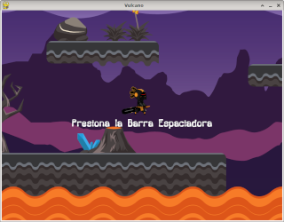

# LittleGameEngine
Un pequeño motor de juegos para aprender a programar con Python

```python
from lge.Engine import Engine
from lge.Sprite import Sprite


# creamos el juego
Engine.Init( (800,440), "The World" )

# activamos la musica de fondo
Engine.LoadSound( "fondo", "../sounds/happy-and-sad.wav" )
Engine.PlaySound( "fondo", loop=-1 )

# cargamos los recursos que usaremos
Engine.LoadImage( "fondo", "../images/Backgrounds/FreeTileset/Fondo.png", (800,440) )
Engine.LoadImage( "heroe", "../images/Swordsman/Idle/Idle_00*.png", 0.08 )

# agregamos el fondo
fondo = Sprite( "fondo", (0,0) )
Engine.AddGObject( fondo, 0 )

# agregamos un Sprite
heroe = Sprite( "heroe", (226,142), "Heroe" )
Engine.AddGObject( heroe, 1 )

# python un poco mas avanzado
heroe.OnUpdate = lambda dt: heroe.NextShape(dt,60)

# main loop
Engine.Run( 60 )
```




## Imágenes
- https://opengameart.org/content/one-more-lpc-alternate-character
- https://opengameart.org/content/free-platformer-game-tileset
- https://opengameart.org/content/2d-game-character-pack-slim-version
- https://opengameart.org/content/game-character-blue-flappy-bird-sprite-sheets
- https://opengameart.org/content/dungeon-crawl-32x32-tiles
- https://www.kenney.nl
- https://opengameart.org/content/2d-platformer-volcano-pack-11

## Sonidos
- https://freesound.org/people/TiagoThanos/sounds/571229/
- https://freesound.org/people/MATRIXXX_/sounds/365668/

## Fonts
- backlash.ttf - Backlash BRK - No contiene información de licencia
- FreeMono.ttf - FreeMono - Parte de los FreeFont de GNU - GNU General Public License
- LiberationMonoRegular.ttf - Liberation Mono - Liberation Fonts License
