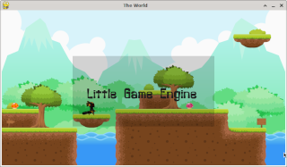
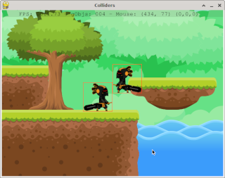
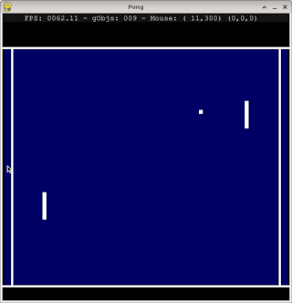
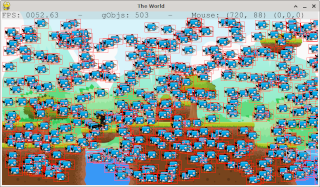

# LittleGameEngine
Un pequeño (e ineficiente) motor de juegos para aprender a programar con Python

```python
from lge.LittleGameEngine import LittleGameEngine
from lge.Sprite import Sprite
from lge.Canvas import Canvas

# creamos el juego
win_size = (800, 440)
lge = LittleGameEngine(win_size, "The World", (255, 255, 0))

# cargamos los recursos que usaremos
resource_dir = "../resources"

lge.LoadImage("fondo", resource_dir + "/images/Backgrounds/FreeTileset/Fondo.png", win_size)
lge.LoadImage("heroe", resource_dir + "/images/Swordsman/Idle/Idle_0*.png", 0.08)
lge.LoadTTFFont("backlash.40", resource_dir + "/fonts/backlash.ttf", 40)
lge.LoadSound("fondo", resource_dir + "/sounds/happy-and-sad.wav")

# activamos la musica de fondo
lge.PlaySound("fondo", True, 50)

# agregamos el fondo
fondo = Sprite("fondo", (0, 0))
lge.AddGObject(fondo, 0)

# agregamos al heroe
heroe = Sprite("heroe", (226, 142))
lge.AddGObject(heroe, 1)

# agregamos un texto con transparencia
canvas = Canvas((200, 110), (400, 200))
canvas.DrawText("Little Game Engine", (30, 90), "backlash.40", (20, 20, 20))
lge.AddGObjectGUI(canvas)

# main loop
lge.Run(60)
```










## Imágenes
- https://opengameart.org/content/one-more-lpc-alternate-character
- https://opengameart.org/content/free-platformer-game-tileset
- https://opengameart.org/content/2d-game-character-pack-slim-version
- https://opengameart.org/content/game-character-blue-flappy-bird-sprite-sheets
- https://opengameart.org/content/dungeon-crawl-32x32-tiles
- https://www.kenney.nl
- https://opengameart.org/content/2d-platformer-volcano-pack-11

## Sonidos
- https://freesound.org/people/TiagoThanos/sounds/571229/
- https://freesound.org/people/MATRIXXX_/sounds/365668/

## Fonts
- backlash.ttf - Backlash BRK - No contiene información de licencia
- FreeMono.ttf - FreeMono - Parte de los FreeFont de GNU - GNU General Public License
- LiberationMonoRegular.ttf - Liberation Mono - Liberation Fonts License
