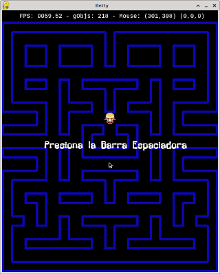

# LittleGameEngine
Un pequeño motor de juegos para incursionar en Python


```python
from lge.Sprite import Sprite
from lge.LGE import LGE

# creamos el juego
engine = LGE( (800,440), (800,440), "The World", (0xFF,0xFF,0xFF) )
engine.SetFPS( 60 )

# agregamos el fondo
fondo = Sprite( "../images/Backgrounds/FreeTileset/Fondo.png", (0,0) )
fondo.Scale( (800,440) )
engine.AddGObject( fondo, 0 )

# agregamos un Sprite
heroe = Sprite( "../images/Swordsman/Idle/Idle_000.png", (220,140), "Heroe" )
heroe.ScalePercent( 0.10 )
engine.AddGObject( heroe, 1 )

# posicionamos la camara
engine.SetCamPosition( (0,0) )

# main loop
engine.Run()
```





---
## Clases
```python
game = LGE( worldDim, winDim, title, bgColor )

# world
width, height = game.GetWorldSize()
game.KeepInsideWorld( gobj, newpos )

# fonts
l = game.GetSysFonts()
game.LoadSysFont( name, size )
game.LoadTTFFont( name, size, path )

# sonidos
game.LoadSound( name, fname ):
game.PlaySound( name, loop=0 ):
game.StopSound( name ):
game.SetSoundVolume( name, volume ):
volume = game.GetSoundVolume( name ):

# camera
game.SetCamPosition( (x,y)) )
x, y = game.GetCamPosition()
width, height = game.GetCamSize()
game.SetCamTarget( gobj, center=True )
game.UnSetCamTarget()
game.AddText( text, position, font, color=(0,0,0), bgColor=None )

# game
game.SetMainTask( task=None )
game.SetFPS( fps )
fps = game.GetFPS()
game.Quit()
game.Run()

# gobjects
game.AddGObject( gobj, layer )
game.DelGObjectByName( name )
game.DelAllGObjects()
gobj = game.GetGObjectByName( name )
game.ShowColliders( color=None )
arr = game.GetCollisions( name )        # [ (gobj,crop), (gobj,crop), ...]

# events
b = game.IsKeyDown( key )
b = game.IsKeyUp( key )
b = game.IsKeyPressed( key )

# sprites
gobj = Sprite( fspecs, (left,bottom), name=None )
idx, key = gobj.GetCurrentShape()
gobj.NextShape()
gobj.SetShape( idx, entry="__no_id__" )
gobj.SetSize( (width,height) )
gobj.Scale( (width,height) )
gobj.ScalePercent( percent )
gobj.Flip( flipX, flipY )

# objects
gobj = GameObject( (left,bottom), (width,height), name=None )
left, bottom = gobj.GetPosition()
width, height = gobj.GetSize()
name = gobj.GetName()
tag = gobj.GetTag()
visibility = gobj.IsVisible()
gobj.SetPosition( (left,bottom) )
gobj.SetSize( (width,height) )
gobj.SetVisible( visibility )
crop = gobj.CollideRect( rect )
if( crop is not None): x, y, width, height = crop

# rect
r = Rect( (x,y), (width,height) )
x, y = r.GetOrigin()
width, height = r.GetSize()
r.SetOrigin( (x,y) )
r.SetSize( (width,height) )
crop = r.CollideRect( rect )
if( crop is not None): x, y, width, height = crop

```

---
## Pendientes
- Luces
- widgets para controlar algunso aspectos del juegp (volumen, etc)

---
## Imágenes
- https://opengameart.org/content/one-more-lpc-alternate-character
- https://opengameart.org/content/free-platformer-game-tileset
- https://opengameart.org/content/2d-game-character-pack-slim-version
- https://opengameart.org/content/game-character-blue-flappy-bird-sprite-sheets
- https://opengameart.org/content/dungeon-crawl-32x32-tiles
- https://www.kenney.nl

## Sonidos
- https://freesound.org/people/TiagoThanos/sounds/571229/
- https://freesound.org/people/MATRIXXX_/sounds/365668/
